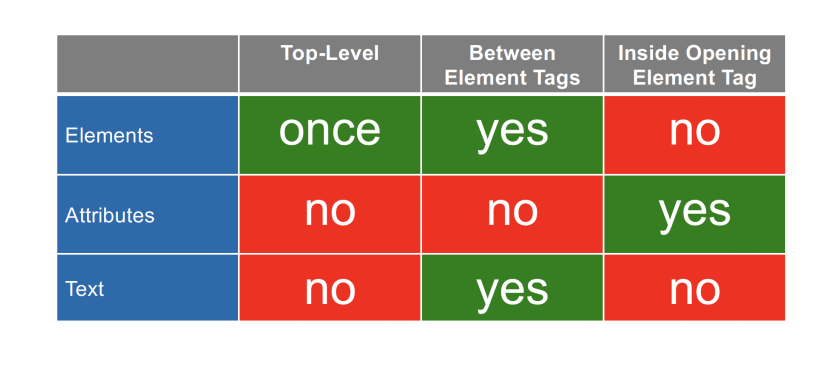

# 05 Syntax

I'm not going to spend heaps of time on this because I feel that it lacks any
meaningful substance.

The key motivation is that in a relational DBMS, the user doesn't have to 
understand the format of the data. In a data lake, the data is stored in the
format uploaded by the user - i.e. JSON, XML, or something else. So this is
now exposed to the user directly. Data is no longer ETLed, we query in-situ.

## CSV

This is a textual format _(can open it in `vim`)_ unlike binary formats which
are more opaque.

There are many different dialects and variants despite there existing a 
standard. This hinders on interoperability.

## Data denormalization

We saw previously that data denormalization is sometimes desirable - this is
especially true in data lakes. We now get to nest tables within tables!

Denormalization is fantastic in read-heavy workloads where we don't want to 
`JOIN` excessively. In read-intensive scenarios, we love anything that is a 
linear scan.

The generic term for denormalized data is **semi-structured data**.

## JSON

Six building blocks

- Strings
- numbers
- booleans
- `null`
- objects
- arrays

JSON keys **must** be strings. Some parsers are lenient, but for compatibility 
with the spec, one should always double-quote key names.

We should also never create any JSON docs with duplicate keys - a lot of 
parsers don't support this. We should try and save ourselves the hassle of
disambiguiating the JSON documents down the line, and just never create such
documents in the first place.

## XML

Extensible markup language. Terribly complex, much more so than JSON anyway.
But we only cover a slim subset of XML features.

```
<person/> == <person></person>
```

Unlike JSON keys, element names can repeat at will - it is even commmon in 
fact. We need to watch out while parenthesizing - our document should of course
be well-parenthesized.

A well-formed XML document has exactly one element at the top-level.

XML forbids users from creating element names that start with `xml` (uppercase,
or lower case, or anything) - it is reserved. XML parsers have to be forward
compatible with any future specs that might arise and introduce special names
starting with XML.

**Attributes** appear in any opening element tags and are basically key-value
pairs.

```xml
<person birth="1879" death="1955">
    <first>(some content)</first>
    <last>(some other content)</last>
</person>
```

or we can single quote the values.

```xml
<person birth='1879' death='1955'>
    <first>(some content)</first>
    <last>(some other content)</last>
</person>
```

**The key is never quoted in XML _(unlike JSON)_. There can also be no
duplicate keys within the same tag**

Attributes can also appear in an empty element tag

```xml
<person age="1912">
```

Note that we cannot nest within attribute values

```xml
<!-- not allowed! -->
<person birth="<date>1879</date>" death="1955">
```

Text cannot appear by itself at the top-level.

Within an element, text can freely alternate with other elements. This is 
called mixed content and is unique to XML

```xml
<person>
    <style>His Royal Highness</style>
    The <title>Duke of <location>Cambridge</location></title>
</person>
```

Note that we can put comments wherever we want

```xml
<person birth="1879" death="1955">
    <first>Albert</first>
    <last>Einstein</last>
    <!-- He is still famous today -->
</person>

<!-- He is still famous today -->
<person birth="1879" death="1955">
    <first>Albert</first>
    <last>Einstein</last>
</person>
<!-- He is -->
<!-- He totally is -->
```

We can identify XML documents by an **optional** declaration containing the
version number and encoding

```xml
<?xml version="1.0" encoding="UTF-8"?>
<person birth="1879" death="1955">
    <first>Albert</first>
    <last>Einstein</last>
</person>
```

The `version` is either `1.0` or `1.1` for legacy reasons that we don't cover.
The `encoding` is just a detail about physical storage. `UTF-8` recommended.

Another optional tag is the doctype declaration - it must repeat the name of
the top-level element.

```xml
<?xml version="1.0" encoding="UTF-8"?>
<!DOCTYPE person>
<person birth="1879" death="1955">
    <first>Albert</first>
    <last>Einstein</last>
</person>
```

or

```xml
<!DOCTYPE html>
<html>
    ...
</html>
```

Doctypes also exist because of historical reasons.

### Escape characters

XML has a bunch of escape characters that need to be used - of course given
that all elements are wrapped in `<>`, we can't use either of these. The ones
listed in the course are

- `<: &lt`
- `>: &gt`
- `": &quot`
- `': &apos`
- `&: &amp`

We can use there anywhere in text and in attribute values, however they aren't
recognized in element names, attribute names, or comments - the first of the
two will lead to well-formedness check failures.

Importantly, one should not that **well-formedness != validity** - validity
requires a schema.

### Overall structure



### Namespaces

Namespaces are like Java packages, C++ namespaces, Python modules, ... In XML,
namespaces are identified with a URI. Oftentimes, these start with `http://`,
despite them not being accessible through a browser. This is similar to how
Java uses the reverse URI notation for Java, e.g. `com.music-encodings.ns.mei`.

Here is an example of this in practice:

```xml
<persons xmlns="http://www.example.com/persons">
    <person>
        <first>(some content)</first>
        <last>(some other content)</last>
    </person>
    <person>
        <first>(some content)</first>
        <last>(some other content)</last>
    </person>
    <person>
        <first>(some content)</first>
        <last>(some other content)</last>
    </person>
</persons>
```

All of the `persons` live in the `http://www.example.com/persons` namespace.
`xmlns` is **not an attribute**, it is in fact a namespace declaration.

Were we to remove the `<persons xmlns=...> </persons>` tags, we would say that
the namespace was _absent_ for the `<person></person>` elements.

In a MathML document, we may get

```xml
<math xmlns="http://www.w3.org/1998/Math/MathML">
    <apply>
        <eq/>
        <ci>x</ci>
        <apply>
            <root/>
            <cn>2</cn>
        </apply>
    </apply>
</math>
```

If we have multiple namespaces, we associate each of them with prefixes, which
then act as shorthands for a namespace. A semantically equivalent doc to the 
one before could look like the following, if we chose prefix `m`.

```xml
<m:math xmlns:m="http://www.w3.org/1998/Math/MathML">
    <m:apply>
        <m:eq/>
        <m:ci>x</m:ci>
        <m:apply>
            <m:root/>
        <m:cn>2</m:cn>
        </m:apply>
    </m:apply>
</m:math>
```

In both cases, all the elements are in the MathML namespace.

_Local name_ is the name that appears right of the prefix if it has one, or
the entire name if it does not. Every element has a local name.

We call the triplet `(namespace, prefix, localname)` the **QName** for 
_qualified name_. If there is no prefix, then we look for the default 
namespace and if we cannot find a default namespace, we call it absent.

The following document is different to the previous two, as the namespace is
absent

```xml
<math>
    <apply>
        <eq/>
        <ci>x</ci>
        <apply>
            <root/>
            <cn>2</cn>
        </apply>
    </apply>
</math>
```

We can have as many namespaces or prefixes as we like with the QName machinery.

```xml
<?xml version "1.0"?>
<a:bar
    xmlns:a="http://example.com/a"
    xmlns:b="http://example.com/b"
    xmlns:c="http://example.com/c"
    xmlns:d="http://example.com/d">
        <b:foo/>
        <c:bar>
            <d:foo/>
            <a:foobar/>
        </c:bar>
</a:bar>
```

As best practice, we should put our namespaces at the top-level. The following
is, however, valid

```xml
<foo:bar xmlns:foo="http://example.com/foo">
    <foo:foo/>
        <bar:foobar xmlns:bar="http://example.com/bar">
        <bar:foo/>
        <foo:foo/>
        <foo/>
        <foo/>
    </bar:foobar>
    <foo xmlns="http://example.com/foo"/>
    <foo:bar/>
    <foo:bar xmlns:foo="http://example.com/bar"/>
    <foo:foo/>
</foo:bar>
```

Attributes can also live in namespaces, however we need to consider that
unprefixed attribute names are **not sensitive to the default namespace**,
i.e. for an unprefixed attribute, the namespace is always absent. Furthermore,
it is possible for two attributes to collide if they have the same local name,
and different prefixes associated with the same namespace _(should not do that
anyways, but it can happen)_. Here is an example where the attributes live in a
namespace.

```xml
<foobar foo:attr="value" bar:attr="value">
```

### Datasets in XML

Both tabular data and nested data can be easily expressed in XML.

### Summary

To summarize, XML is better-suited for text-oriented tagged data because of its
unique mixed-content feature. JSON is however much more popular nowadays.
