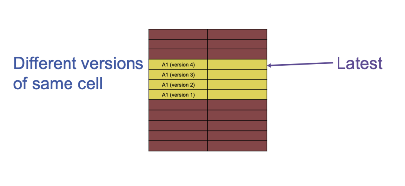

# 06: Wide Column Stores

We looked into some textual formats in the previous section. How are these
stored on a cluster?

The problem with HDFS is the latency - it performs very well for large files,
but suffers when the file is small, e.g. when we access millions of small
XML or JSON files.

_Wide column stores_ were invented to provide more control over performance
over accesses to objects that range from a few bytes to around 10MB. I.e. the
things that are too numerous to store on a local file system or DBMS, and too
small to be efficiently stored on a distributed file system.

## Wide Column Store: Sweetspot between RDBMS and Object storage

- More tightly integrated with prallel data processing systems
- Richer logical model than the simple KVS
- Efficient handling of small values _(bytes and kBs)_.

However, it isn't quite an RDBMS

- No data model for values: we just intepret everything as byte arrays
- Values up to 10MB implies potential nesting inside the data formats
- No schema for the tables
- No query language like SQL - we expose a lower-level API akin to KVS.
- Tables can be very sparse - we will see that this is why the data is 
denormalized

HBase was initially designed by Facebook to power their messaging system in
2010.

## Logical data model

The data model of HBase is built upon the realization that `JOIN`s are very
expensive - we want to avoid these. If we can pre-compute these, then we can
directly work on the denormalized data.

As a consequence of this, and contrary to an RDBMS which typically limits a 
table to 256 columns, the number of columns in a denormalized table can be very
large.

The second fundamental design decision of HBase is:

> Store together what is accessed together.

This is a flavour of batch processing, which is predominant in Big Data - we
like to reduce the impact of latency by having few large requests instead of
loads of small ones.

However, this is in direct conflict with efficiently writing data.

- Writing denormalized data is cumbersome: we need to deal with insertion, 
update, and deletion anomalies.
- Writing the data under the constrain that what is accessed together should be
stored together.

HBase is an enhanced KVS. It is multidimensional, as we will see, because we
have the `rid`, the column family, the column qualifier, and the version. We
want to efficiently look up any cell, even any version, given its key.

## Tables and Row IDs

- Key: `(row, column, version)`
- keys are sortable
- Values can be up to around 10MB _(clobs and blobs)_

We want to sort the keys so that close keys are stored together!

A row ID is logically just a byte-array - we can create this from `string, int`
etc...

In the Facebook messaging system, the row key could be `userID_convserationID`.

## Column Families

Intuitively, we can think of this as the tables that would exist if the data
were normalized and had to be `JOIN`ed. The name of a family is a `string`.

In the Facebook messaging system, the column families could be

- `messages`
- `metadata`
- `attachments`

Nice for sparsity because not all messages have attachments.

## Column Qualifiers

Columns themselves also have a qualifier in addition to their column family.
Unlike in RDBMS, columns aren't bound to a specific type - they are just raw
byte-arrays as far as HBase is concerned. The user can figure out what to do
with the data themselves. It's common to store blobs in these cells.

## Versioning

HBase keeps track of past versions of the data - any value is associated with a
timestamp. We also keep timestamps for deletion. These timestamps can be 
overwritten for more control over versioning.

The versioning system works well for the timeseries-bound nature of messages.

## Logical queries

`GET(table, rid)`: retrieve a specific row. We can optinally specify which 
columns we want, or the latest `k` versions within a time range.

`PUT(table, rid, col_family, col_qualifier)`: put a new value in a cell. We can
optionally specify the version - if none is specified, we use the current
timestamp.

HBase offers a locking mechanism at the row-level.

`SCAN(table)`: query a whole table, or part of it. We can restrict to specific
column families or qualifiers, or to a specific interval of rows. Scans are
essential for high-throughput parallel processing.

`DELETE(table, rid, col_family, col_qualifier)`: delete a value with a specific
version.. Optionally, we can delete all values with version less or equal to a
specific version.

## Physical architecture

We partition by row and by column. Rows are split in consecutive **regions**, 
where each is specified by a lower and an upper row key _(inclusive and 
exclusive respectively)_. **A partition is called a store** and corresponds to 
the intersection of a region and a column family.

Note that hot spots may occur _(we access small interval of `rid`s very 
frequently)_. To help we can use hashing or prefixing a salt to `rid` to better
distribute these across the RegionServers.

The topology is the same as HDFS

- **HMaster:** assign responsibility of each region to one of the 
RegionServers. This means that for a given region, all of its column families
_(within a regoin this is called a store)_ are handled by the same 
RegionServer. We only need to assign responsibility to a single RegionServer -
HDFS handles all the replication!
- **RegionServers:**  If a region grows too big, e.g. because of many writes to
the same `rid` interval, the region is split by the RegionServer. If a 
RegionServer has too many regions compared to other RegionServer, then the 
HMaster can reassign regions. If a RegionServer fails, the HMaster can reassign
all regions to other RegionServers.

These are just processes running on the nodes. We normally want the HMaster to
run on the same physical system as the NameNode.

## Physical Storage

Physically, a store is just an organized set of cells. Each value in a cell is
identified by a `(rid, col_family, col_qualifier, version)`. The column familiy
is the one identified by a store, the `rid` has to fall within the region 
handled by the store, and the last two can be arbitrary.

This 4-tuple is called the key.

All the cells within a store are persisted on HDFS using what we call 
**HFiles**. It is just a boring flat list of `KeyValues`. They are sorted

1. By `rid` ascending
2. Column family _(trivially unique for a given store)_
3. My column qualifier ascending
4. By version descending

As a result, **all versions of a given cell that are in the same HFile are
located together and one of them is the latest**.

At the bit level, we store as `keyLength | valueLength | key | value` because
the keys and values are variable length. Recall the logical key structure from 
above:

- `rid` _(variable length)_
- `col_family` _(variable length)_
- `col_qualifier` _(variable length)_
- `timestamp` _(64-bit fixed)_

Concretely, we store contiguously:

- `row_length`
- `row (key)`
- `col_family_length`
- `col_familiy`
- `col_qualifier` _(don't need its length because we know key length)_
- `timestamp` _(64-bit, recall)_
- `key_type` _(one byte, used for marking as deleted)_

`KeyValues` within an HFile are stored within an HFile which are organized
in **HBlocks** _(not to be confused with HDFS blocks)_ with a size of 64kB. If
the last `KeyValue` exceeds the boundary of the HBlock, we grow it slightly -
it is thus variable-length.

The HFile contains an index of all HBlocks within its boundaries which is 
loaded into memory prior to reading anything from the HFile, and we keep it in
memory for subsequent reads. This allows us to efficiently find out which
HBlock holds the `KeyValues` for a specific key.

## Log-Structured Merge Trees

In General, old data is persisted to HDFS in HFiles, and fresh data stays in
memory on the RegionServer node.

When accessing data, HBase needs to generally look everywhere for cell values,
i.e. every HFile and in memory.

As long as there is room in memory, fresh KeyValues are added there. When that
is full _(or another limit is reached)_, we flush all KeyValues to a new HFile.
We do this sequentially in ascending order, HBlock by HBlock _(sorting is done
whenever a new KeyValue is added with a tree map for instance, so we needn't 
do that here)_. We use a WAL to prevent loss when something crashes. We call 
this the HLog. When the HLog is full, we flush all KeyValues in memory to a 
new HFile. 

After many flushes, the number of HFiles can grow - this becomes impractical.
We do compaction when necessary. Since the data in the individual HFiles is
sorted, we can merge in $O(n)$ time.

## Bootstrapping lookups

In order to know which RegionServer a client needs to communicat with, there is
a big lookup table - this lookup table is also an HBase table, but it fits on
a single machine. We call this the **meta table**.

## Caching

Instead of just keeping a MemStore in memory, we also have a cache.

## Bloom filters

We don't want to look for KeyValues in every HFile. We can basically tell you
with absolute certainty if a key _doesn't_ belong to a given HFile, otherwise
we have a _maybe_ - just look at the HFiles that maybe have the key. We can
drastically reduce the search space.

## Data Locality and Short Circuiting

RegionServers are colocated with DataNodes _(same machine)_. So when we flush
KeyValues to a new HFile, a replica of each HDFS Block of the HFile is written
by the DataNode process living on the same machine. This makes accessing 
KeyValues on local storage very efficient because there is no need to 
communicate with the NameNode - we just read from local storage. We call this
**short-circuiting** in HDFS.

It is of course possible that some replicas will be relocated during 
rebalancing of DataNodes, making short-circuiting not always possible.
