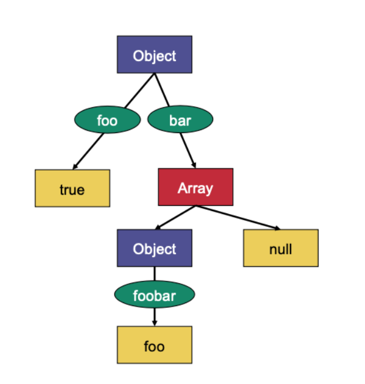
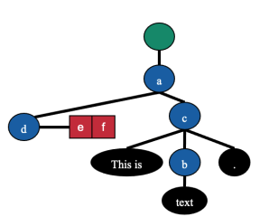
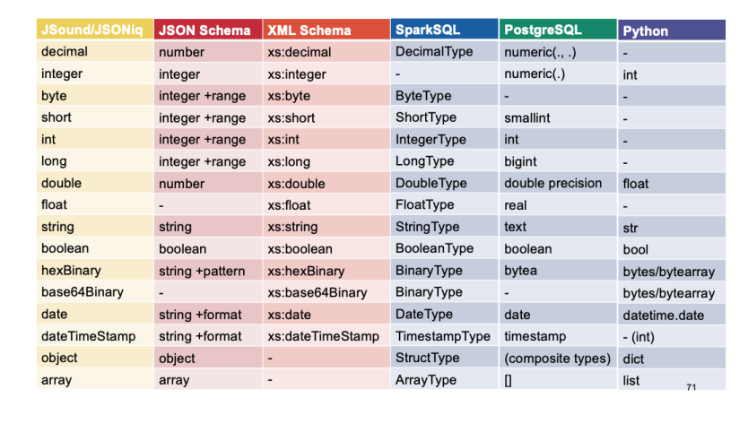
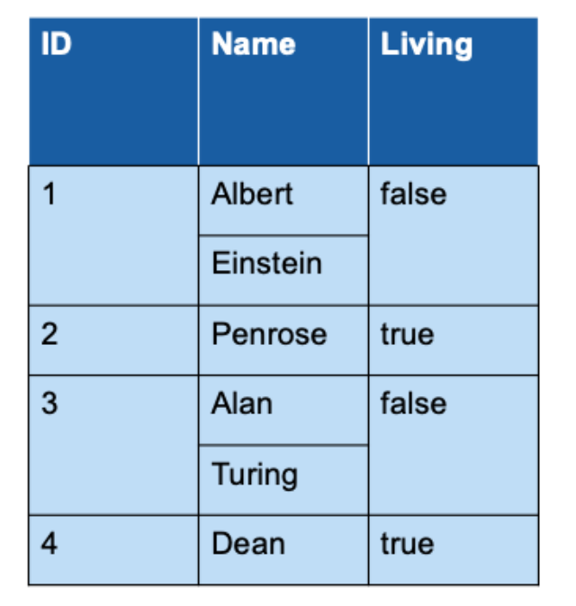

# 07 Data Models and Validation

Everything, ultimately, is stored as binary. It isn't always appropriate for 
the system to modify this directly - the spirit of data independence is to
abstract this away. This is called data modelling.

## JSON information set

JSON is basically a tree - it does not enforce relational integrity, atomic
integrity, or domain integrity. Our leaves are atomic values

- `string`
- `number`
- `booleans`
- `null`

And our intemerdiate nodes are

- `objects` _(nested tree, basically)_
- `arrays` _(list of values)_



Formaly, nodes are called **information items** and form the logical building
block of the **information set**.

## XML information set

This differs from the JSON information set. Abstractly, in JSON, the edges
were labeled _(as wee in the image above)_, but in XML the nodes are named.
These labels are also called **object keys**. 

Otherwise put, a JSON information item does not know with which key it is 
associated to an object _(if at all)_ whereas an XML element or attribute 
information item knows its name.



```xml
<?xml version="1.0" encoding="UTF-8"?>
<!DOCTYPE metadata>
    <metadata>
        <title
            language="en"
            year="2019"
        >Systems Group</title>
    <publisher>ETH Zurich</publisher>
</metadata>
```

### Document information item

Has properies `[children]` which is the information item `metadata` and
`[version]` which is `1.0`

### Element information items

There is one element information item per element. In our above example, we
have three.

Firstly, we have `metadata` which has

- `[local name] = metadata` 
- `[children]` which are element information items `title` and `publisher`
- `[attributes]` which is empty
- `[parent]` which is the Document information item

Then `title` has

- `[local name] = title` 
- `[children]` the character information items `Systems Group`
- `[attributes]` attribute information items `language` and `year`
- `[parent]` which is the element information item `metadata`

Finally we have something similar for `publisher` element information item,
noting that it has no children.

### Attribute information items

We take as example `language` from above. It has three important properties

- `[local name]` language
- `[normalized value]` en
- `[owner element]` which is the element information item `title`

This works basically the same way as for the `year` attribute in `title`.

### Character information items

We take as example, the `S` in `Systems Group` above. It has information items

- `[character code]` which is the unicode code point for the letter S
- `[parent]` which is the element information item `title`

It is also possible to group these characters into a **text information item**,
but this is non-standard. They all share the same parent, and we give them a
property `[characters]` which is the list of characters in the text.

## Validation

This is checking for structural constraints in a tree structure parsed from XML
or JSON _(or other)_. Although it seems similar to schemas in DBMS, it isn't
quite true - in a DBMS, the schema is defined before populating the table, and
thus our table will fulfill our constraints at all times. We call this
**valid against a schema**. JSON and XML documents, can exist without a schema
and contain arbitrary attributes - validation happens after reading. We call
this **schema on read**.

We enter the realm of heterogeneous data, where in DBMS it was homogeneous.

**We also discuss the difference well-formedness, highlighting that it is 
different from validity.** In order to validate a document, it must be 
well-formed.

## Item types

We distinguish between atomic types and composite types like

- Lists
- Records
- Maps
- Sets



## Sequence types

Some type systems provide options for indicating the number of elements in a
sequence

- Just once
- `Option<T>`: zero or one `?`
- Any number - zero or more. Often represented with a Kleene star `*`
- At least one - one or more. `+`

We distinguish between **collections** of items and **lists/arrays** of items.
Collections are on the outer level, and can be very large and corresponds to a
relational table. Lists on the other hand refer to nested structures, which we
may want to restrict in size for performance reasons _(few MB at most)_.

> A collection of integers is not the same as a collection that contains a 
> single array of integers

## Validating JSON

We can use **JSound os JSON schema** for this. The following document

```json
{
    "name" : "Einstein",
    "first" : "Albert",
    "age" : 142
}
```

Can be validated by this JSound schema

```json
{
    "name" : "string",
    "first" : "string",
    "age" : "integer"
}
```

Or by this JSON Schema schema

```json
{
    "type" : "object",
    "properties" : {
        "name" : "string",
        "first" : "string",
        "age" : "number"
    }
}
```

JSound has richer syntax, so we focus on that. We can fo the following

- Require the presence of a key: `"!key":`. In JSON Schema, we would have
    `"required": [ "key1", "key2", ..., "keyn"]` followed by the `"properties"`

In JSound, **extra keys are forbidden**. The following document is not valid 
against the previous JSound schema

```json
{
    "name" : "Einstein",
    "first" : "Albert",
    "profession" : "physicist"
}
```

We call the schemas to be **closed**. **In JSON Schema, extra properties are
allowed by default**. We can change this with `"additionalProperties": false`.

What about nested structures? We can do this in JSound with
`{ "numbers": [ "integer" ] }` for example. We can do this over multiple 
dimensions, too: ` { "matrix": [[ "decimal" ]] }`. **We can nest arbitrarily in 
JSound**.

We can validate similary with a more complex JSON Schema schema which would
look something like

```json
{
    "type" : "object",
    "properties" : {
        "datapoints" : {
            "type" : "array",
                "items" : {
                    "type" : "object",
                    "properties" : {
                        "features" : {
                            "type" : "array",
                            "items" : {
                            "type" : "number"
                        }
                    },
                    "label" : {
                        "type" : "integer"
                    }
                }
            }
        }
    }
}
```

In JSound, we have other features like

- `?`: Allow for null values
- `@`: one or more fields are primary keys
- `=`: indicate a default value

We can use this schema

```json
{
    "datapoints" : [
        {
            "@id" : "int",
            "features" : [ "double" ],
            "label?" : "integer",
            "set" : "string=training"
        }
    ]
}
```

to validate

```json
{
    "datapoints" : [
        {
            "id" : "10",
            "features" : [ 1.2, 3.4, 5.6 ],
            "label" : null,
            "set" : "training"
        },
        {
            "id" : 11,
            "features" : [ "9.3", 2.6, 2.4 ],
            "label" : 1
        },
        {
            "id" : 12,
            "features" : [ 1.1, 4.3, 6.5 ],
            "label" : "0",
            "set" : "test"
        }
    ]
}
```

JSound also allows us to accept any value. For example

```json
{
    "!name" : "item",
    "!first" : "item",
    "age" : "number"
}
```

Where here require the fields `name` and `first`, but we let their types be
anything.

In Json Schema, we could do something like this, using `true` or an empty 
object in lieu of the type.

```json
{
    "type" : "object",
    "required" : [ "name", "first" ]
    "properties" : {
        "name" : {},
        "first" : true,
        "age" : "number"
    },
    "additionalProperties" : false
}
```

The following document is valid against the JSound and JSON Schema schemas 
above.

```json
{
    "name" : [ "Ein", "st", "ein" ],
    "first" : "Albert",
}
```

JSON Schema allows you to forbit a field with `false`.

```json
{
    "type" : "object",
    "properties" : {
        "name" : "string",
        "first" : false,
    }
}
```

We can also do unions of types in both schema languages.

```json
{
    "anyOf" : [
        { "type" : "string" },
        { "type" : "array" }
    ]
}

"string|array"
```

In JSON schema and JSound respectively.

In JSON schema, but not JSound, we can do conjunctions, xor, and negation of
types as well.

```json
{
    "allOf" : [
        { "type" : "string", "maxLength" : 3 },
        { "type" : "string", "minLength" : 2 }
    ]
}

{
    "oneOf" : [
        { "type" : "number", "minimum" : 2 },
        { "type" : "number", "multipleOf" : 2 }
    ]
}

{
    "not" : { "type" : "array" }
}
```

## XML Validation

This is similar to JSON validation. We generally want to use XML Schema for 
this.

```xml
<?xml version="1.0" encoding="UTF-8"?>
<xs:schema xmlns:xs="http://www.w3.org/2001/XMLSchema">
    <xs:element name="foo" type="xs:string"/>
</xs:schema>
```

We note here that we use the XML Schema namespace. This is prescribed by the 
standard and must be used. Stick to prefixes `xs` or `xsd` - this is popular.
Do not use the default namespace as it leads to confusion and ultimately 
sadness.

The top-level element is always `schema`. XML Schema has builtin types that I
will not list here - go look at the spec. Note that `null` does not exist,
this is JSON-specific.

We can restrict types, e.g.

```xml
<!-- schema -->
<?xml version="1.0" encoding="UTF-8"?>
<xs:schema xmlns:xs="http://www.w3.org/2001/XMLSchema">
    <xs:simpleType name="airportCode">
    <xs:restriction base="xs:string">
        <xs:length value="3"/>
    </xs:restriction>
    </xs:simpleType>
    <xs:element name="foo" type="airportCode"/>
</xs:schema>

<!-- doc that is valid against the schema -->
<?xml version="1.0" encoding="UTF-8"?>
<foo>
    ZRH
</foo>
```

Complex types like sequences work too if you're into that

```xml
<!-- schema -->
<?xml version="1.0" encoding="UTF-8"?>
<xs:schema xmlns:xs="http://www.w3.org/2001/XMLSchema">
    <xs:complexType name="complex">
    <xs:sequence>
        <xs:element
            name="twotofour"
            type="xs:string"
            minOccurs="2"
            maxOccurs="4"/>
        <xs:element
            name="zeroorone"
            type="xs:boolean"
            minOccurs="0"
            maxOccurs="1"/>
        </xs:sequence>
    </xs:complexType>
    <xs:element name="foo" type="complex"/>
</xs:schema>

<!-- doc that is valid against the schema -->
<foo>
    <twotofour>foobar</twotofour>
    <twotofour>foobar</twotofour>
    <twotofour>foobar</twotofour>
    <zeroorone>true</zeroorone>
</foo>
```

We can, of course, nest for even more complex types. We can use complex types
for something boring. E.g.

```xml
<!-- schema -->
<?xml version="1.0" encoding="UTF-8"?>
<xs:schema xmlns:xs="http://www.w3.org/2001/XMLSchema">
    <xs:complexType name="complex">
        <xs:sequence/>
    </xs:complexType>
    <xs:element name="foo" type="complex"/>
</xs:schema>

<!-- doc that is valid against the schema -->
<foo/>
```

We can also validate mixed content _(because of course we can)_

```xml
<!-- schema -->
<?xml version="1.0" encoding="UTF-8"?>
<xs:schema xmlns:xs="http://www.w3.org/2001/XMLSchema">
    <xs:complexType name="mixedContent" mixed="true">
        <xs:sequence>
        <xs:element
            name="b"
            type="xs:string"
            minOccurs="0"
            maxOccurs="unbounded"/>
        </xs:sequence>
    </xs:complexType>
    <xs:element name="foo" type="mixedContent"/>
</xs:schema>

<!-- doc that is valid against the schema -->
<foo>Some text and some <b>bold</b> text.</foo>
```

All types of content can additionally contain attributes, which always have
a simple type.

```xml
<!-- schema -->
<?xml version="1.0" encoding="UTF-8"?>
<xs:schema xmlns:xs="http://www.w3.org/2001/XMLSchema">
    <xs:complexType name="withAttribute">
        <xs:sequence/>
        <xs:attribute name="country"
        type="xs:string"
        default="Switzerland"/>
    </xs:complexType>
    <xs:element name="foo" type="withAttribute"/>
</xs:schema>

<!-- doc that is valid against the schema -->
<foo country="Switzerland"/>
```

Finally, we don't have to give types to everything - we can nest a type 
declaration with no name attribute.

```xml
<?xml version="1.0" encoding="UTF-8"?>
<xs:schema xmlns:xs="http://www.w3.org/2001/XMLSchema">
    <xs:element name="c">
        <xs:complexType>
            <xs:sequence/>
        </xs:complexType>
    </xs:element>
</xs:schema>
```

XML schema documents are XML documents themselves. Cool or something idk.

## Data Frames

JSON is rad. Unlike CSV which can only express flat data, JSON can express
either flat data or nested homogeneous data. XML is more powerful but JSON is
sufficient for most cases.

Dataframes are just JSON objects with some constraints. We disallow additional
attributes, and we forbid schemas that allow for object or array values to be
too permissive _(can't use `any`, but can use `string, integer, date,...`)_.

We do allow for schemas that permit `null` values.

```json
{
    "ID" : "integer",
    "Name" : [ "string" ],
    "Living" : "boolean"
}
```



We can do rad things like

```json
{
    "ID" : "integer",
    "Who" : [
        {
            "Name" : "string",
            "Type" : "string"
        }
    ],
    "Living" : "boolean"
}
```

Which is equivalent to the following _less natural_ schrma

```json
{
    "ID" : "integer",
    "Who" : {
        "Name" : [ "string" ],
        "Type" : [ "string" ]
    },
    "Living" : "boolean"
}
```

The latter is used for optimization in some scenarios.

## Data formats

XML and JSON are textual formats and we don't always want to store the data in
this format

- Space efficiency: text isn't great
- performance efficiency: small binary is good for reading quickly.

Dataframe compatible data can be stored efficiently - if I know the schema,
then I don't need to store the field name for every record, e.g. `"name"`.

In general, data formats can be classified as follows

- Whether they require validity against a dataframe compatible schema
    (Parquet, protobufs) or not (JSON, XML, YAML, etc...)
- Whether they allow for nestedness (Parquet, etc...) or not (CSV)
- Whether they are textual (CSV, XML, JSON) or binary (Parquet)
