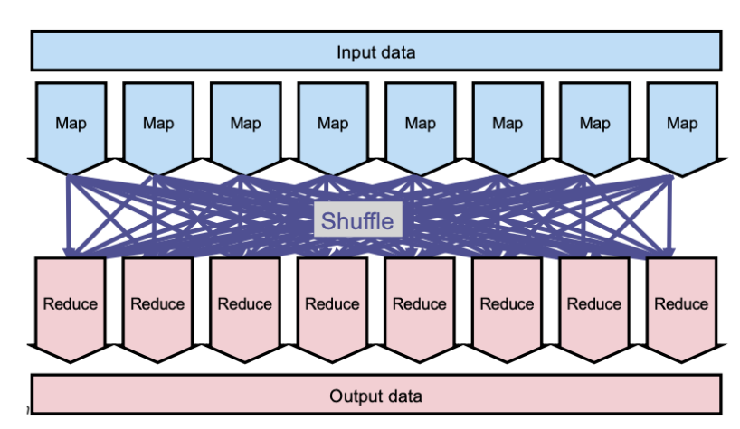

# Massive Parallel Processing

We covered how and where to store datasets, and we know how to model 
heterogeneous data. We know how to build when applicable, and the various
binary formats / textual formats they can be stored as. Now we process.

## Map, Shuffle, Reduce

This is a pretty logical way to handle things. We list the example of counting
different types of cats, although in the lecture it was Pokemon. The same
principle applies to both.

- Everybody takes a subet of the data, and then **maps** it. For example into
    something like `{ pikachu: 5, squirtle: 10, ... }`
- Then we shuffle: assign some other people a subset of the data that they will
    count. Then the mappers will walk to each of these people, the **reducers**
    and report the count they had for the types they are interested in
- Finally, we **reduce**, the reducers will combine all the maps together and
    return a final count for each type.

This is the high-level idea behind **MapReduce**.



The model is that the input data, intermediate data, and output data is that
they are all large collections of key-value pairs. The types of these key-value
pairs can be different at every level, i.e. output isn't the same as input.
Commonly, the intermedaiate key-value type will be the same as the output
type.

## MapReduce at the Logical Level

Everything starts with partitioning the input - MapReduce calls this 
**splitting**.

Each key-value is then fed into a **map** function. This isn't done in pairs,
this is done in larger batches.

After this, we partition again in a logically sorted manner, i.e. all of the
pairs with the same key are in the same partitions.

The **reduce** function is then called for every unique key on all the pairs
with that key. It outputs zero, one, or more output pairs.


## MapReduce Architecture

MapReduce can read its input from many places; that could be cloud storage,
HDFS, wide column store, etc... This data can be _huge_, for example 
Petabyte-sized with thousands of machines involved.

We opt for a centralized architecture, similarly to HDFS and HBase.

- **JobTracker**: main node
- **TaskTracker**: worker nodes

We want the JobTracker to run on the same machine as the NameNode, and the 
TaskTrackers to be colocated with DataNodes.

As the map phase progresses, we run the risk of saturating memory. Like with
HBase, we sort intermediate pairs by key and flush to disk when necessary as
a **SequenceFile**. As more flushes happen, we compact the SequenceFiles 
similarly to log-structures merge trees in HBase.

When the map phase is over, each TaskTracker runs an HTTP server to connect and
share intermediate data with one another, ensuring that the same keys are on
the same physical machines. This is called **shuffling**.

## Input and Output formats

Recall, we want the input to be key-value pairs! This is pretty straightfoward
for RDBMS and wide-column stores - just take the primary key and sub-tuple 
value we are interested in.

In other cases, we may need to be creative. For example, mapping files to pairs
of key-values can be done by choosing as value some line, and as key the start
offset of that line in the text _(how many characters to get to the start of 
the line)_. This implies taking `\n` as a special separator, for example. A
variation on this is reading `N` lines at a time, or using some non-standard
separator that is user-defined.

So how would we count words with this input format? When we map, we can map
each word in every line to `(word, 1)`, i.e. a word with a count of one. To
reduce, we just add all of these together and the output will consist of a
list of unique key-values, the value associated being the count of a word and
a key being the word itself.


How about filtering on, for example, the lines containing a word? Recall that
map can output **zero, one, or more key-values**. So here we can have a map
function that outputs a subset of its input based on a predicate provided by
the user. In this case we would use the identity function to reduce.

We can do something similar with projection. Imagine we want to project JSON
on some subset of the keys - this of course requires the map function to 
understand the input, i.e. parse it. We once again use the identity function to
reduce.

## Combine Functions

We can additionally specify a **combine** function on top of the map/reduce
functions. This is executed during the map phase, after the mapping hsa
happened.

For example in our word count example, we _could_ have the same word appearing
five times on the same line. But there we would output five key-values. We can
make the reducer function's job a little easier by combining these during the
map phase into `(word, 5)` and sending it to the reduce phase, instead of
`5 x (word, 1)`. It is just used for compression, basically.

The function is normally called strategically when we flush key-value pairs to
a SequenceFile on disk, and when we compact SequenceFiles. **There is no 
guarantee that it will be called at all, though**. This is decided at runtime
by MapReduce. In most cases, the combine function is the same as the reduce
function. In general we want to only do this with the Reduce function is 
associative and commutative.

## The API

This is all Java. Pretty low-level.

A `Mapper` looks like

```java
import org.apache.hadoop.mapreduce.Mapper;
public class MyOwnMapper extends Mapper<K1, V1, K2, V2>{
    public void map(K1 key, V1 value, Context context)
        throws IOException, InterruptedException
        {
            // ...
            K2 new-key = ...;
            V2 new-value = ... context.write(new-key, new-value); ...;
        }
}
```

And a `Reducer` class looks like

```java
import org.apache.hadoop.mapreduce.Reducer;
public class MyOwnReducer extends Reducer<K2, V2, K3, V3> {
    public void reduce (
            K2 key,
            Iterable<V2> values, // so that we can call `next()` iteratively
            Context context)
        throws IOException, InterruptedException
        {
            // ...
            K3 new-key = ...;
            V3 new-value = ... context.write(new-key, new-value); ...;
        }
```

To run the job, we get a block like

```java
import org.apache.hadoop.mapreduce.Job;
public class MyMapReduceJob {
    public static void main(String[] args) throws Exception {
        Configuration conf = new Configuration();
        Job job = Job.getInstance(conf, "word count");
        job.setMapperClass(MyOwnMapper.class);
        job.setReducerClass(MyOwnReducer.class);
        // job.SetCombinerClass(MyOwnCombiner.class) if we want that
        FileInputFormat.addInputPath(job, ...);
        FileOutputFormat.setOutputPath(job, ...);
        System.exit(job.waitForCompletion(true) ? 0 : 1);
    }
}
```

Normally the user of terms like mapper, reducer, combiner _should be_ reserved
only for the Java interfaces and classes that implement them. We should refer
to, for instance, "map task", "map phase", etc... to refer to the architecture.

## Tasks

This is an actual job that will be executed. The idea of the map phase is 
abstract, and defines that will be done at the logical key-value level. It is
basically declarative in that sense.

There is oe map task for every input split, so that there are many map tasks
as there are partitions of the input! These tasks are executed sequentially,
i.e. there is no intra-task parallelism.

Similarly, a reduce task is called on a subset of the intermediate input, and
there are as many reduce tasks as there are partitions in the list of 
intermediate key-value pairs _(i.e. as there are unique keys)_.

There are no combine tasks - these are ad-hoc during flushing and compaction.

## Slots

The physical resources partitions used for map tasks are called **map slots**.
We also define **reduce slots** in the same way. The same slot, upon finishing
executing some task, can execute some other task. **Each slot has one cpu,
and some memory capacity**. There is no intra-slot parallelism.

In the first version of MpaReduce, map slots and reduce slots were all
pre-allocated at launch. However this could learly lead to parts of the cluster
being blocked _(reduce slots sit idle while they wait for the map phase to
complete)_.

## Impedance mismatch: blocks vs. splits

> Bring the query to the data.

Recall that the TaskTrackers are normally colocated with a DataNode. We want
the slots on that machine to be executing map tasks that are associated to the
data in the DataNode that lives on the same machine as it - we just have to
perform a local read. Like with HBase, we call this **short-circuiting.**

Recall that splits contain full records - a key-value pair only belongs to one
split _(to be processed by one map task)_. However these splits are logical,
so what happens physically in HDFS? While most key-value pairs will belong to a 
set of full 128MB blocks, we may have that the first and/or last recod will be 
in a different HDFS block and require a remote read over HDFS. HDFS actually 
provides an API for partial reads exactly for this reason.
