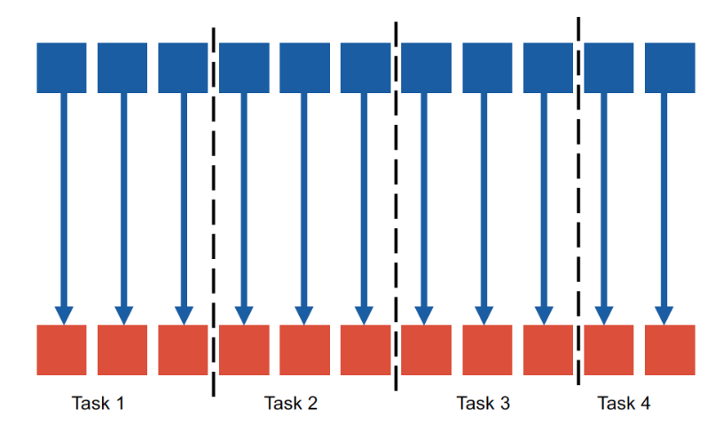
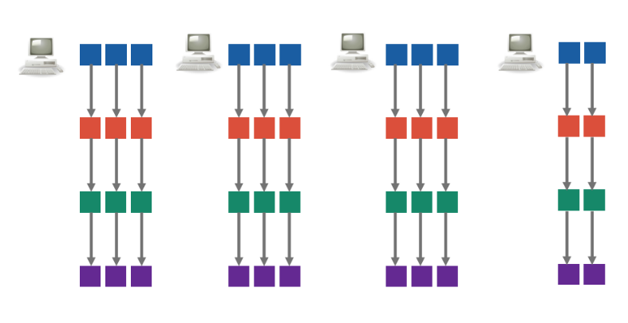
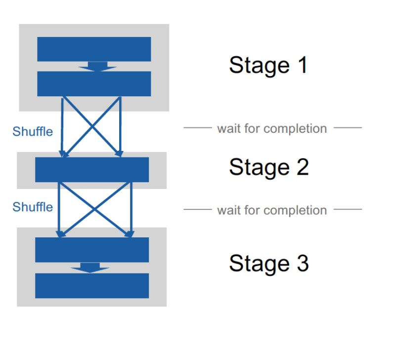

# 10 Generic Dataflow Movement

MapReduce is very simple, but many complex use-cases will involve multi-job
sequences. The API is also very low-level, which isn't always well-suited to
the users that need a higher-level interface.

## RDDs - Resilient Distributed Datasets

We represent our dataflow processing as a DAG. Every node represents some
intermediate data which are called RDDs because:

- they remain in memory or on disk on a best-effort basis, and they can be 
    recomputed if required, and they are 
- distributed across multiple machines.

### Creation

We read a dataset from local disk, cloud storage, distributed filesystem, ...

### Transformation

We can transform one RDD into another RDD. Mapping or reducing in this model
are two very specific cases of transformations - transformations are more
generic in the Spark model.

### Action

RDDs undergo some final action leading, making an output persistent. We can
output its contents to local disk, cloud storage, distributed filesystem, 
stdout, ...

### Lazily evaluated

This is importnat. Creations of transformations etc... do nothing until the
last node _(output)_ of the DAG is triggered, leading all previous nodes
connected transitively to be triggered.

## Example

```scala
// create an RDD
val rdd1 = sc.parallelize(
    List("Hello, World!", "Hello, there!")
)
// -> List("Hello, World!", "Hello, there!")
```

We could also do

```scala
// create an RDD
val rdd1 = sc.textFile("/user/hadoop/directory/data-*.txt")
// -> List("Hello, World!", "Hello, there!")
```

Nothing is set into motion here because of the lazy evaluation.

```scala
val rdd2 = rdd1.flatMap(
    value => value.split(" ")
)
// -> List("Hello,", "World!", "Hello,", "there!")
```

We could then do the following, which triggers computation:

```scala
rdd2.countByValue() // -> Map(("Hello" -> 2), ("there!" -> 1), ("World!" -> 1))
```

## Transformations

We will classify some of the different types of transformations

- **Unary transformations:** take a single RDD as input. For example
    `rdd.filter(predicate)`, `rdd.map(func)`, `rdd.flatMap(func)`. We note that
    `flatMap` corresponds to the map of MapReduce because each value becomes
    one or more output values - the information on which output values came
    from which input values is lost in this operation.
- **Binary transformations:** two RDDs as input. `rdd1.union(rdd2)`, 
    `rdd1.intersect(rdd2)`, `rdd1.subtract(rdd2)`
- **Pair transformations:** RDDs can have any type, but we love to work with
    key-values, so Spark defines some transformations specifically tailored for
    these. `rdd.first()`, `rdd.second()`, 
    `rdd.reduceByKey(neutralElem, binaryOperator)` corresponding to the reduce
    phase from MapReduce, `rdd.groupByKey()`, `rdd.sortByKey()`, 
    `rdd.mapValues(func)` where we apply a map only to the values

We have others too, but I'm not going to list the whole spec. Consult doc or
something for that.

## Actions

- **Gather output locally**: only works if this fits in local memory, otherwise
    it will overflow.
- `rdd.count()`: counts in parallel the number of values in the input RDD
- `rdd.countByValue()`: also parallel, but outputs a map from value to count.
- `rdd.saveAsTextFile` which saves the entire RDD to a sharded dataset on Cloud
    storage
- `rdd.saveAsObjectFile()` which is the same sa the previous, but writes as
    binary. It is up to the user to define how to serialize this - Spark is
    agnostic to it.

## Physical Architecture

### Narrow Dependency Transformations

The computation of each output value involves a single input value. This is
nice because we can easily parallelize - if the input is partitioned and spread
across the cluster in particular because the output will be computed in 
partitions as well with no need to communicate between the nodes. `map()`,
`flatMap()`, `filter()`, ... fall into this category.



If the transformation is applied to a freshly-read dataset from HDFS, each
partition will correspond to an HDFS block - we can short-circuit HDFS so that
the transformation mostly involves local reads although a few remote ones may
be needed.

The way that tasks are executed is very similar to how it was done with YARN.

We love to chain narrow dependency transformations together if we are able to.
We get something pretty like this (instead of a mess of interconnected nodes).



Since everything is lazily evaluated, we can actually execute the chain as a 
single task when we need it!

### Executors

The user can parametrize the number of executors in Spark and the resources 
they have available to them, which corresponds to a YARN container.

```
$ spark-submit
    --num-executors 42
    --executor-cores 2
    --executor-memory 3G
    my-application.jar
```

### Wide Dependency Transofmrations

So what happens when we need to shuffle? Physical execution will actually
consist of a sequence of stages which shuffling happening between them.



Note that this doesn't have to actually be a linear sequence - it can totally
be a DAG as well, i.e. we have a partial ordering. We can linearize the DAG
by executing each stage in some linear order _compatible_ with the underliying
partial ordering. e.g. Stage 1 on entire cluster, then Stage 2, then Stage 3,
etc...

### Optimizations

We can **pin RDDs** for example, meaning that we trigger the computation of the
reverse transitive closure _(reverse the DAG, travel up to the leaf)_ and
persist it on disk or in memory. This is just a way to cache basically.

We can also **pre-partition** - if Spark already knows that the data is where
it should be, then we needn't shuffe. For example if the data is pre-sorted
before being grouped by the sorting keys.

## DataFrames in Spark

The DAG nodes are the first-class citizens of Spark's dataflow - given this
independence, Spark has no difficulty dealing with nested and heterogenous 
datasets. **This burden is placed on the user**, the model is quite low-level.

For example here

```scala
rdd = spark.sparkContext.textFile(’hdfs:///dataset.json’)
rdd2 = rdd.filter(lambda l: parseJSON(l))
rdd3 = rdd2.filter(lambda l: l[’key’] = 0)
rdd4 = rdd3.map(lambda l: (l[’key’], l[’otherfield’]))
result = rdd4.countByKey()
```

In later versions of Spark, we extended with DataFrames and SparkSQL, bringing
a high-level declarative language to the ecosystem.

A DataFrame is just a specific type of RDD essentially - **it is an RDD of
rows satisfying relational integrity, domain integrity and sometimes atomic
integrity as well although not always**.

In Spark, every DataFrame has a schema. It is very natural to want to query 
this with SQL, and so SparkSQL is introduced for DataFrames.

DataFrames aren't only a logical tool to make the users more productive - it
also allows Spark to optimize the memory footprint and processing by using
columnar formats, so that values belonging to the same column are stored 
together. Furthermore, since schema is known, we needn't repeat attribute names
for every record.

Under the hood, a SparkSQL query is converted into an internal DataFrame
transformation and eventually into a physical query plan. It likes to push
projections down, as a query optimizer should always try to do.

## Input formats

Consider this example

```scala
// read JSON, create a view
df = spark.read.json(’hdfs:///dataset.json’)
df.createOrReplaceTempView("dataset")
// evaluate SQL query
df2 = df.sql("SELECT * FROM dataset "
"WHERE guess = target "
"ORDER BY target ASC, country DESC, date DESC")
// collect first 10 rows
result = df2.take(10)
```

The schema is automatically inferred from the JSON Lines file, which adds a
static performance overhead that doesn't exist for raw RDDs.

CSVs also come with schema discovery _(although optional here)_.

Builtin input formats can be specified when creating a DataFrame from a dataset
with a simple method call after the read command.

```scala
df = spark.read.json("hdfs:///dataset.json")
df = spark.read.parquet("hdfs:///dataset.parquet")
df = spark.read.csv("hdfs:///dir/*.csv")
df = spark.read.text("hdfs:///dataset[0-7].txt")
df = spark.read.jdbc("jdbc:postgresql://localhost/test?user=fred&password=secret", ...)
df = spark.read.format("avro").load("hdfs:///dataset.avro")
```
