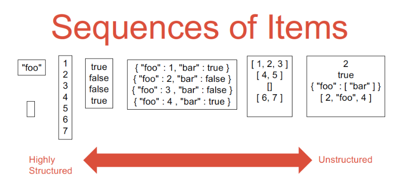

# Querying Denormalized Data

Up until now, we saw that we can store denormalized data in either a data lake
or in a managed DBMS like a document store. However, the options for querying
are relatively limited

- API with an imperative host language (think MongoDB API)
- Push SQL to its limits, including ad-hoc extensions to support nestedness

APIs are unsatisfactory or complex analytics use cases. We like the 
expressivity and ease of use of declarative query languages a lot more. Think
Spark DataFrame API vs SQL.

Even if we nest SQL in a host language, there is still additional logic needed,
for example

```scala
df1 = spark.read.json("hdfs:///input.json")
df1.createGlobalTempView("input")
df2 = df1.sql("SELECT foo
FROM input
WHERE bar = ’foobar’
")
df2.show()
```

Using explode syntax and the like is fine for simple use cases, but as soon
as a dataset becomes more complex, for example nestedness with a depth of 10,
it falls apart. At best we have super complex SQL queries. For example, the
following isn't particularly readable

```sql
SELECT *
FROM person
LATERAL VIEW EXPLODE(ARRAY(30, 60)) tabelName AS c_age
LATERAL VIEW EXPLODE(ARRAY(40, 80)) AS d_age;

-- or 
SELECT key, values, collect_list(value + 1) AS values_plus_one
FROM nested_data
LATERAL VIEW explode(values) T AS value
GROUP BY key, values
```

In this chapter we introduce **JSONiq**, a language that is tailored for
denormalized data. Through data independence on top of data lakes and ETL-based
DBMS, it offers powerful querying or denormalized data.

It is important to note that we can use SparkSQL and similar with ad-hoc 
user-defined functions (UDF) to handle nested data. But this is suboptimal 
because the query optimizer isn't aware of these as they exist outside of its
domain. They are black-box.

## JSONiq Data Model

We distinguish between **declarative** and **functional** query languages. 
JSONiq is functional. Unlike a functional programming language like Scala which
often presents as a sequence of chained function calls, a good functional
query language should look more like a high-level declarative query language.

Every JSONiq expression returns a sequence of items. This can either be 
structured, or unstructured.



Sequences of items are flat, i.e. sequences cannot be nested. They scale 
massively to contain billions or trillions of items. One item is equivalent to
a singleton sequence.

We can access a key from a sequence using dot-syntax. For the example, we 
assume that the `"o"` field is an array.

```
json-doc("file.json").o
```

In this case, this will return a singleton sequence of arrays (i.e. one array).
We can unbox the array using empty bracket syntax.

```
json-doc("file.json").o[]
```

The dot syntax works on sequences too. It will extract the value associated 
with key in every object of the sequence. We can also chain these together.

```
json-doc("file.json").o[].a.b[]
```

We can filter using


```
json-doc("file.json").o[].a.b[][$$.c = 3]
```

We can also access the sequence item at position `n` with synax

```
json-doc("file.json").o[].a.b[][n]
```

We can index into array with the double square bracket syntax

```
json-doc("file.json").o[[2]].a
```

Double square bracket also works for sequences. Any array that has less 
elements than the requested position will result in an empty output for that
element, as well as elements thay are not arrays.

```
json-doc("file.jsoin").o[].a.b[[2]]
```

We mustn't confuse sequence positions (single square bracket) with array
positions (double square bracket).

## Schema Discovery

A solid rule of thumb is to always check the first object of a collection to 
get a rough idea of what the layout looks like, even though there is always the
risk of heterogeneity, it is almost always a step in the right direction.

```
collection(
    "https://www.rumbledb.org/samples/git-archive.jsonl"
)[1]
```

You can also check the top `N` objects

```
collection(
    "https://www.rumbledb.org/samples/git-archive.jsonl"
)[position() le 5]
```

We can also get all top-level keys.

```
keys(collection(
    "https://www.rumbledb.org/samples/git-archive.jsonl"
))
```

As well as getting the unique values associated with a key (in the following
example, `type` is a top-level key).

```
collection(
"https://www.rumbledb.org/samples/git-archive.jsonl"
).type
```

We can perform duplicate elimination.

```
distinct-values(collection(
"https://www.rumbledb.org/samples/git-archive.jsonl"
).type)
```

We can aggregate. The five basic functions are `count, sum, avg, min, max`.
The last four require numeric values, otherwise they will throw an error.

## Bindings with cascades of let clauses

We can write:

```
json-doc("file.json").o[].a.b[].c = 1
```

Equivalently as:

```
let $a := json-doc("file.json")
let $b := $a.o
let $c := $b[]
let $d := $c.a
let $e : $d.b
let $f := $d[]
let $g := $f.c
return $g = 1
```

Variables always start with `$` - this is pretty common in functional 
languages. We can reuse the same variable name, as you would expect to see with
`let` clauses in other languages like Rust. Each variable is visible in all
subsequent `let` clauses within the same expression. Everything is **scoped**,
i.e. a variable only exists within its scope. In particular, the following is
incorrect.

```
(let $a := json-doc("file.json")
let $b := $a.o
let $c := $b[]
let $d := $c.a
let $e : $d.b
let $f := $d[]
let $g := $f.c
return $g = 1
) + $a
```

## FLWOR Expressions

Corresponds to `SELECT-FROM-WHERE` in SQL, but more expressive and generic.
FLWOR expressions are a powerful feature of JSONiq.

- SQL clauses have a specific ordering. In JSONiq, anything can appear in any
    order with the exception of the first and last clauses.
- JSONiq supports `let` clauses, which makes it easier to organize and write
    complex queries
- Possible to iterate at higher levels of nesting in JSONiq because they aren't
    are semantically different from Cartesian products as they are in SQL.
- The semantics of FLWOR clauses is simple and clean due to its inherently
    functional nature.

### For clauses

```json
for $x in 1 to 10
return
{
    "number": $x,
    "square": $x * $x
}

{ "number" : 1, "square" : 1 }
{ "number" : 2, "square" : 4 }
{ "number" : 3, "square" : 9 }
{ "number" : 4, "square" : 16 }
{ "number" : 5, "square" : 25 }
{ "number" : 6, "square" : 36 }
{ "number" : 7, "square" : 49 }
{ "number" : 8, "square" : 64 }
{ "number" : 9, "square" : 81 }
{ "number" : 10, "square" : 100 }
```

We can also do cool stuff like

```json
for $x in 1 to 3
for $y in 1 to $x
return [ $x, $y ]

[1, 1]
[2, 1]
[2, 2]
[3, 1]
[3, 2]
[3, 3]
```
