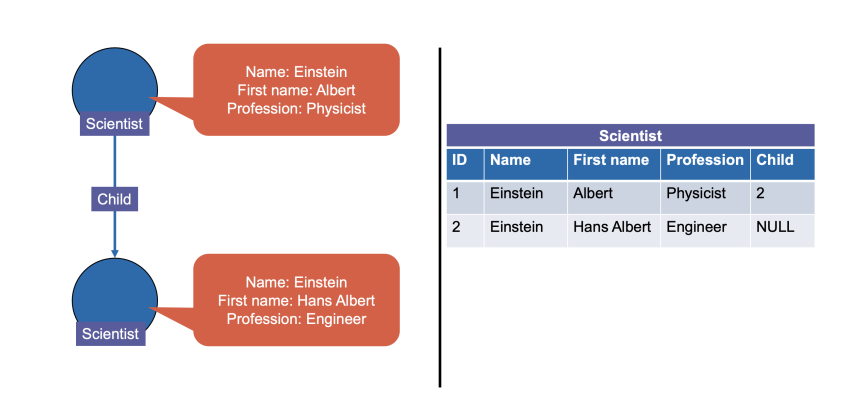

# Graph Databases

Relational tables are very easy for us to wrap our heads around. However, the
more we normalize our data to separate concerns, the more we end up having to
join afterwards. This is an exceptionally expensive operation at large scales.

The idea is to try and avoid joins altogether - perhaps by encoding the
relationship between tables directly into the table itself...

We describe a few different types of graph databases.

- Labeled property graph model versus triple stores
- Read-intensive vs. write-intensive.
- Local vs. distributed
- Native vs non-native: some graph DBs are just a layer on top of another
    DB, like Postgres or something.

## Labeled Property Graphs

We firstly define a **label** as a string tag attached to a node or an edge in
a graph.

We additionally define **properties**, which is a string-to-value map 
associated to each node or edge. You can think of the properties as a JSON
object associated with each node or edge.

We can pretty easily convert a relational table to a labeled property graph

- Labels can be seen as table names
- Nodes as records
- Properties as attribute values for records
- Edges as foreign key / primary key relationships



## Triple Stores

This is a simpler model than labeled property graphs - it views the graph as
nodes and edges that all have labels, but without any properties.

Each edge is a triple with the label of the origin node called **subject**, 
label of the edge called **property**, and label of the destination node called
the **object**.

Labels can be pretty much anything, whether that be URIs, atomic values, or 
absent altogether.

## Querying Graph DBMS

We focus on **Cypher**, which is a querying language for labeled property
graphs. This is done using pattern matching like semantics, the syntax that
looks like ASCII art.

```
MATCH (alpha)-[:A]->(beta)-[:B]->(gamma)
RETURN alpha, beta, gamma
```

I.e. match these edge patterns _(representing some relation)_ and return the
nodes satisfying it. This query returns an output with three columns 
`alpha, beta, gamma` which are of type `node`. 

We can filter on node or edge properties.

```
MATCH (alpha)-[:A]->(beta:yellow)-[:B]->(gamma)
RETURN alpha, beta, gamma
```

We can also filter on node or edge properties as well

```
MATCH (alpha)-[:A]->(beta { name: ’Einstein’ })-[:B]->(gamma)
RETURN alpha, beta, gamma
```

Here are some other examples of things that we can do.

```
// filter on label and property
MATCH (alpha)-[:A]->(beta)-[:B]->(gamma: blue { name : ’ETH’})
RETURN alpha, beta, gamma

// reverse edges in pattern syntax
MATCH (alpha)-[:A]->(beta)-[:B]->(gamma)<-[:B]-(delta)
RETURN alpha, beta, gamma, delta

// reuse variable to look for cycle
MATCH (alpha)-[:A]->(beta)-[:B]->(gamma)<-[:B]-(alpha)
RETURN alpha, beta, gamma

// match longer paths
MATCH (alpha)-[*1..4]->(beta)<-[:B]-(alpha)
RETURN alpha, beta
```

## Stuff The Slides

In this chapter, the slides go a lot deeper than the textbook does.

Traversing a graph through a table is expensive, and requires joins. Graph DBs
are a lot more expressive in this regard. We define **index-free adjacency**.

We can represent node relationships in various ways, such as adjancency 
matrices or incidence matrices.

In a **labeled property graph**, such as we see in Neo4j, both nodes and edges
hold _properties_. These are basically just key-values. Cypher, Neo4j's query
language, defines `WITH` clauses that function similarly to JSONiq's `let`
clauses.

```cypher
WITH [ 1, "foo", null, { foo: 1, bar: [ { foobar: TRUE} ] } ] AS list
RETURN list [3].bar
```

Iteration also works similarly

```cypher
WITH [ { foo:1 }, { foo:2 }, { foo:3 } ] AS a
UNWIND a as b
RETURN b

WITH [ { foo:1 }, { foo:2 }, { foo:3 } ] AS a
UNWIND a as b
WITH b.foo + 1 AS c
RETURN [ c ]

WITH [ { foo:1 }, { foo:2 }, { foo:3 } ] AS a
UNWIND a as b
WITH b.foo + 1 AS c
WHERE c >= 3
RETURN [ c ]
```

**anchoring** refers to finding the initial start nodes. This is done with a
`MATCH` clause.

```cypher
// finding node with `name = Einstein` is the anchoring step
MATCH (alpha {name: 'Einstein' })-[:A]->(beta)-[:B]->(gamma)
RETURN gamma
```

We can combine `MATCH` and `WITH`

```cypher
MATCH (george {name: 'George'})<--(otherPerson)
WITH otherPerson, toUpper(otherPerson.name) AS upperCaseName
WHERE upperCaseName STARTS WITH 'C'
RETURN otherPerson.name
```

The `CREATE` clause created a nodes, and edges between nodes.

```cypher
CREATE (einstein:Scientist {name: 'Einstein', first: 'Albert' }),
       (eth:University {name: 'ETH Zurich' }),
       (einstein)-[:VISITED]->(eth)
```

### RDF (Resource Description Framework)

RDF is triple-based. We have `(subject, property, object)` triples. Literals
in RDF include XML Schema types.

We allow for blank nodes - these can be the subject or the object, but not
the property.

There are a few languages that we can use for expressing RDF.

Turtle

```turtle
@prefix geo: <http://www.example.com/geography#> .
@prefix countries: <http://www.example.com/countries#> .
@prefix eth: <http://www.ethz.ch/#> .

eth:self geo:isLocated countries:Switzerland .
eth:self geo:population 25000 .
```

JSON-LD

```json
{
    "@context": {
    "eth": "http://www.ethz.ch/#",
    "countries": "http://www.example.com/countries#"
},
    "@id" : "eth:self",
    "geo:isLocatedIn": "countries:Switzerland",
    "geo:isLocatedIn": "countries:Europe",
    "geo:population" : 25000
}
```

RDF-XML

```xml
<rdf:RDF
    xmlns:rdf="http://www.w3.org/1999/02/22-rdf-syntax-ns#"
    xmlns:geo="http://www.example.com/geography#">
    <rdf:Description rdf:about="http://www.ethz.ch/#self">
        <geo:isLocatedIn rdf:resource="http://www.example.com/countries#Switzerland"/>
        <geo:isLocatedIn rdf:resource="http://www.example.com/countries#Europe"/>
        <geo:population>25000</geo:population>
    </rdf:Description>
</rdf:RDF>
```

Where `geo:isLocatedIn` corresponds to 
`http://www.example.com/geography#isLocatedIn` in this case.

RDF has no semantics - just triplets.
