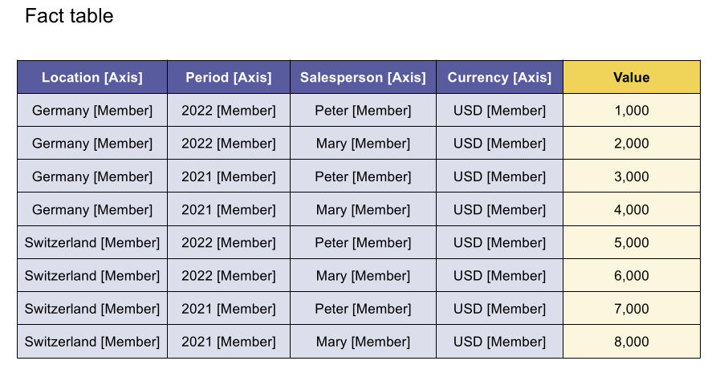
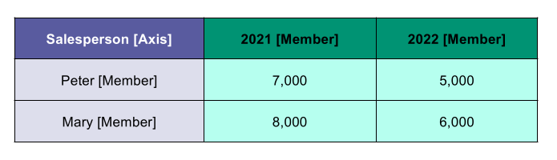
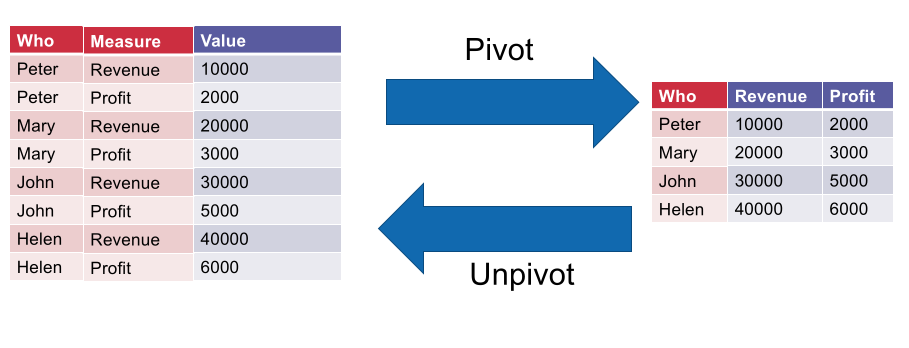

# Data Cubes

When we briefly explored RDBMS at the beginning of the course, we mainly 
considered OLTP workloads. Now, we look at OLAP. OLTP is mainly lots of writes,
and OLAP is designed for lots of complex reads, including aggregations, meaning
a small amount of huge queries instead of loads of small queries.

We will see that OLAP is all about redundancy.

## Fact Tables

We consider a table that is built of axes. We can slice into these, i.e.
look at only a subset of these. This is kind of like the following SQL 
statement.

```sql
SELECT * -- we don't select the columns we have sliced into, as we know their value
FROM table
WHERE location = 'Swizerland [Member]' AND currency = 'USD [Member]'
```



After slicing, we can **dice**. There are usually between one and three dicers,
often two.



We can also aggregate, of course. We call this **roll-up**.

## Implementation

There are two flavors, **ROLAP** and **MOLAP**. 

ROLAP is just fact tables as we saw before, with dimensions and values. We 
define the notions of **pivoting** and **unpivoting**. 



## MDX: Multi-Dimensional Expressions

Our cubes are just tables. This isn't a problem - we can query this with SQL.
But if we are performing frequent aggregates, this becomes hard to read and
cumbersome to write. MDX is made for querying multi-dimensional data more
ergonomically.

```md
SELECT
    [Measures].Members ON COLUMNS,
    [Location].[Geo].Members ON ROWS
FROM [Sales]

WHERE [Products].[Line].[Laptops].[MBP]
```

- First part of the expression dices.
- Second part of the expression slides.
